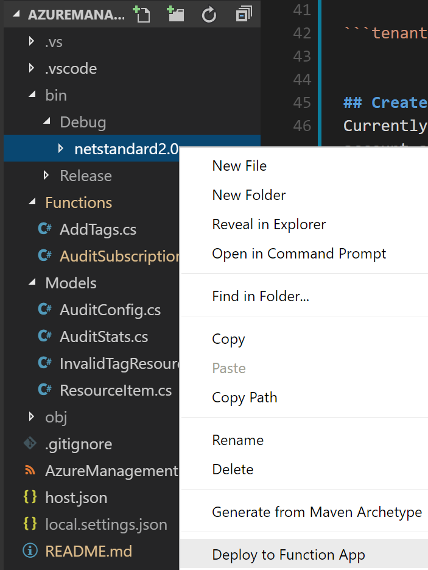

# Automated Tag Synchronization for Azure Resources
This is a proof-of-concept application that synchronizes mandatory tags set on Resource Groups to the resources they contain. Synchronization happens automatically based on a user-defined schedule. The application is broken down into two Functions:

- **AuditSubscriptionTags:** Executes on a user-defined schedule and reads in subscription configuration data from the AuditConfig table. This configuration includes a list of tags that a given resource group in that subscription must implement. The function iterates through each resource group and determines if tag changes are required (new or modify). If so, a message is added to a queue with the details required to add / modify the tag(s) for that resource.
- **AddTags:** Processes each message added to the queue by the AuditSubscriptionTags function and modifies the tags as necessary. If there are any issues with the tagging, an error is logged in the *InvalidTagResources* table. Any resource type listed in this table are exempted from future runs by *AuditSubscriptionTags*. 

# Prerequisites
## Deveopment Environment
The application is written in C# (.Net Core) and can be developed and tested using a PC, Mac, or Linux using the Functions 2.0 runtime. As such, it is highly recommended the user complete all setup and installation instructions documented here: [Code and test Azure Functions locally](https://docs.microsoft.com/en-us/azure/azure-functions/functions-run-local).
It is assumed you are working with an updated version of [Visual Studio Code](https://code.visualstudio.com/) with the [Azure Functions extension](https://marketplace.visualstudio.com/items?itemName=ms-azuretools.vscode-azurefunctions) installed.

You must also have a recent version of [Azure Storage Explorer](https://azure.microsoft.com/en-us/features/storage-explorer/) installed.

## Service Principal
The application must interact with your subscription using a [service principal ID](https://docs.microsoft.com/en-us/powershell/azure/create-azure-service-principal-azureps?view=azurermps-6.0.0). Run one of the following commands to create one:

Azure CLI

```
az ad sp create-for-rbac --name ServicePrincipalName
```

PowerShell
```
New-AzureRmADServicePrincipal -DisplayName ServicePrincipalName
```
When the service principal is created, be sure to document its ID, key, and the AAD tenant ID. This will be required later when the solution is deployed to Azure.

# Deployment
## Create and configure the Function App 
In the Azure Portal, create a new Function App by navigating to App Services and selecting the **Add** button in the upper left. In the Marketplace section, select *Function App*. In the create dialogue, enter the desired name, resource group, and storage account. Be sure to keep Windows as the OS type. It is recommended (but not required) to enable the *Application Insights* option.

Once the Function App is created, a few follow-up configurations are necessary:

### Upgrade function runtime
In the Azure Portal, navigate to the Function App and select *Function App Settings*. Switch the runtime version to **beta**.

NOTE: At the time of this writing, there are issues with the latest beta runtime. For this applicaiton to work, you will need to navigate to Application Settings and set the value of FUNCTIONS_EXTENSION_VERSION to **2.0.11651-alpha**.

### Configure the App Settings
Next, navigate to *Application Settings*. In the Application Settings section of that page, add the following settings:

```appId```: Set to the Service Principal ID

```appSecret```: Set the Service Principal key

```tenantId```: Set to the GUID that represents your AAD tenant


### Create the configuration tables
Currently, two tables must be manually created within the storage account associated to the Function App before the solution can run. The easiest way to locate the table is by examining the resource group the function was deployed into.

Use Azure Storage Explorer to create tables with the following names: *AuditConfig* and *InvalidTagResources*

### Create the queue
In the same storage account, use Storage Explorer to create a new queue with the following name: *resources-to-tag*

## Deploy the Functions
Finally, clone the repository to your workstation and open the root folder in VS Code. Assuming you have the Azure Functions extension installed, you can deploy to your Function App by navigating to the **bin/Debug/netstandard2.0** folder and right-clicking. In the dialogue menu, select *Deploy to Function App*. You will be prompted to select a valid function app in your subscription. Use the one you created earlier.




# Configuration and Operation
By default, the ```AuditSubscriptionTags``` function runs once every 4 hours. The ```AddTags``` function is triggered by messages placed into the ```resources-to-tag``` queue created earler. You can manually initialize the process by clicking the Run button on ```AuditSubscriptionTags``` the portal. It is recommended to do this once after the deployment has been completed so that the columns for the ```AuditConfigTable``` are created.

When in operation, the solution works by interacting with the tables hosted in the Storage Account.

## AuditConfig
For each subscription you wish to audit, you must define a configuration item for it in the AuditConfig table. Configuration currently consists of two columns.

- ```SubscriptionId```: The GUID (ID) that represents the subscription.

- ```RequiredTags```: A comma separated list of tags that must be synchronized from the resource group to the resource item.

Once configuraiton is completed, your table shoud look like the following:


## AuditStats
Information about every subscription audit performed by ```AuditSubscriptionTags``` is recorded in this table.

## InvalidTagResources
Azure does not currently have a unified API for resource tagging. There are cases where exeptions will be thrown when attempting to tag certain resource types. These exceptions are handled by the ```AddTags``` function and written to this table.

 

 When invoked, ```AuditSubscriptionTags``` reads all items from this table and skips any resource that matches a given Type. That way, repeated API calls that are known to fail are not made. Developers can use the information to update the code to better handle these specific resources. Administrators can use this table to tag these resources either via a script or manually.

 # FAQ
 TBD